# ADK Context & Memory Architecture

## 1. Purpose

Everything an agent framework does around memory exists to answer one question:
**what goes into the context window on this call?**

The context window is rebuilt from scratch before every model call. Nothing accumulates
automatically. Session state, event history, long-term memory, and static instructions are
four separate stores with different lifetimes — and on each call, something has to decide
which parts of each become the prompt.

These notes trace that decision, layer by layer.

## 2. Architecture

### 2.1 Context Window Structure

  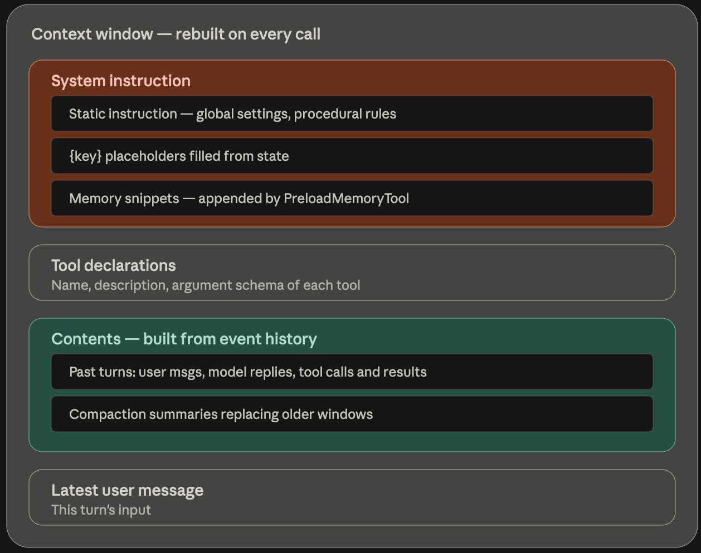

Four blocks, rebuilt every call. State never appears as its own block — it only shows up as
substituted values inside the system instruction. Tool declarations consume tokens too, which
is easy to forget. Contents is the only block that grows without bound, which is why
compaction targets it and nothing else.

### 2.2 Agent Context Architecture

  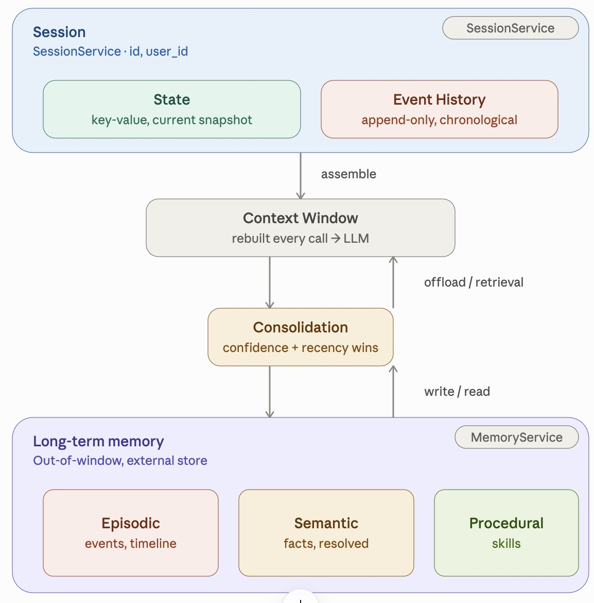

## 3. Use Cases

### 3.1 Session Service

  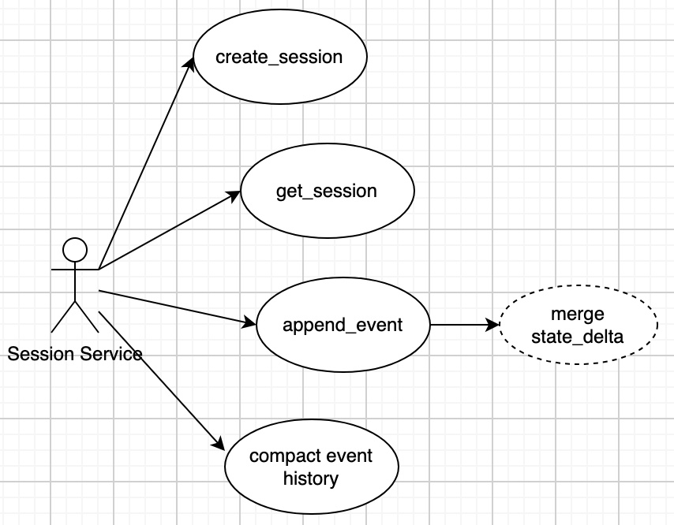

### 3.2 Memory Service

  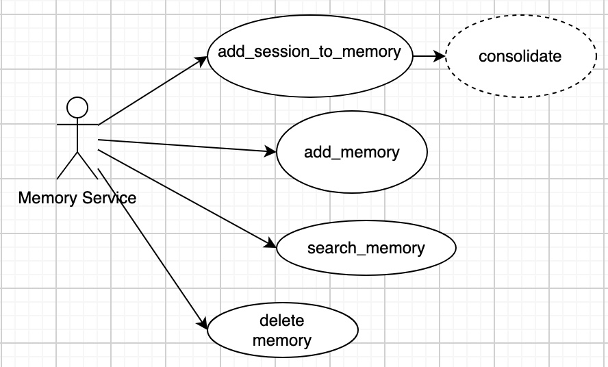

### 3.3 Agent

  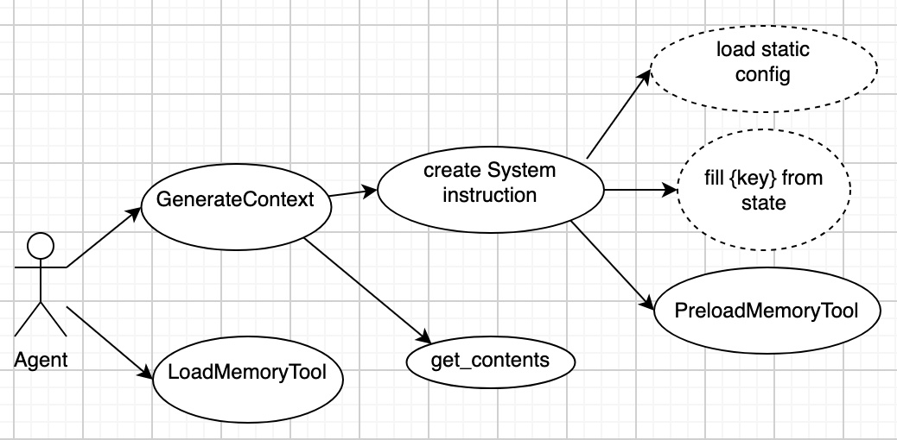

PreloadMemoryTool sits *inside* GenerateContext; LoadMemoryTool sits *outside* it, as a sibling.
That placement is the whole difference between the two tools: one finishes before the model is
called, the other is triggered by what the model returns.

### 3.4 Runner

  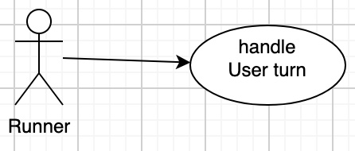

## 4. Sequence Diagrams

### 4.1 create_session

  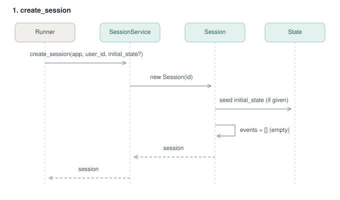

### 4.2 append_event

  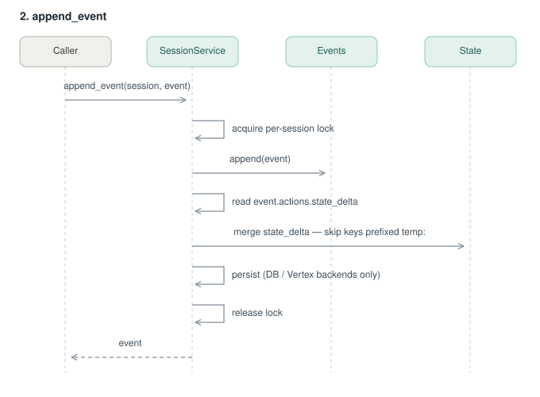

One call does two things atomically: the event is appended to the log, and its `state_delta` is
merged into state. There is no second "apply" step and no alternative write path. Writing to
`session.state` directly bypasses both the persistence layer and the per-session lock.

### 4.3 compact event history

  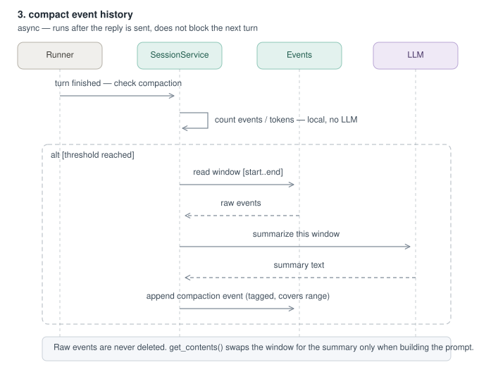

The threshold check is a local count — no model involved. Only when it passes does a summarization
call happen. The summary becomes a new event tagged with the range it covers; the raw events it
covers are left untouched in storage.

### 4.4 add_session_to_memory

  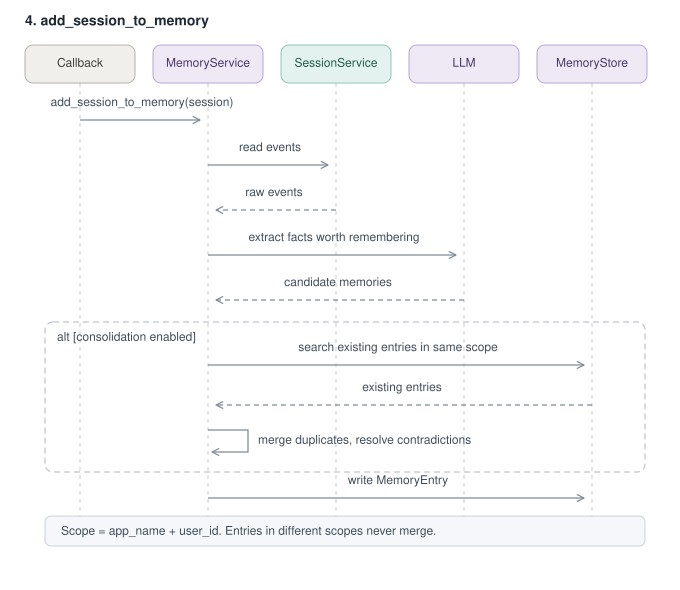

Extraction is done by a model, so what gets remembered is not fully predictable — it may skip a fact
you assumed would be kept. Consolidation compares newly extracted facts against existing entries in
the same scope, one atomic fact at a time. Facts that simply weren't re-extracted this round are not
deleted.

### 4.5 search_memory

  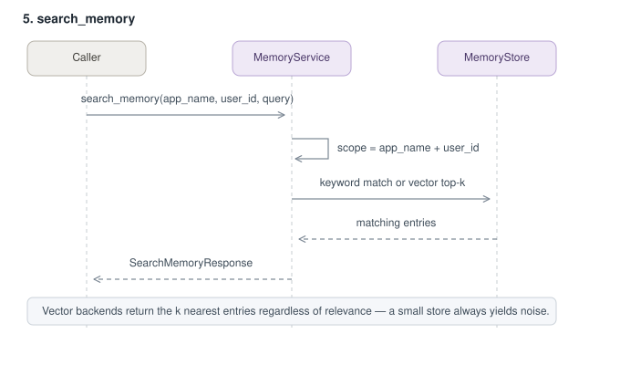

### 4.6 add_memory / delete_memory

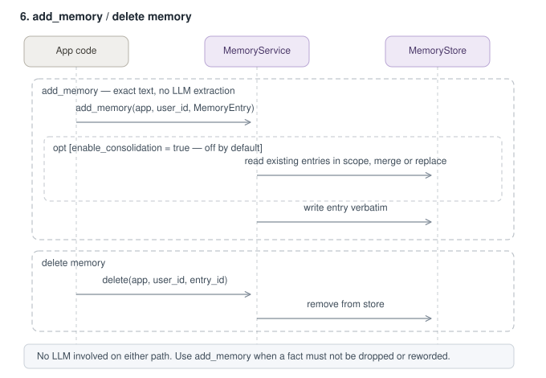

  

The opposite trade-off from 4.4: no model, no rewriting, exactly the text you pass in. Consolidation
is opt-in here rather than automatic, so without the flag repeated writes accumulate duplicates.

### 4.7 PreloadMemoryTool

  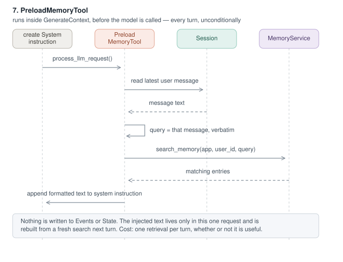

No arrow reaches Events or State. The retrieved text exists only in this one request. The query can
only be the user's message verbatim, because the model hasn't run yet and there is nothing better
to use.

### 4.8 LoadMemoryTool

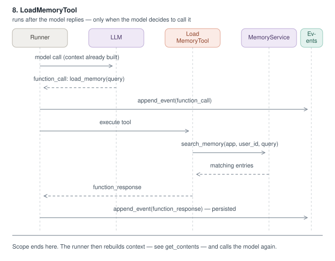

  

Both the call and its result are written to the event log, so they stay in every later prompt until
compaction removes them. The query here is written by the model, which makes it sharper than
Preload's — paid for with an extra model round trip.

### 4.9 GenerateContext

  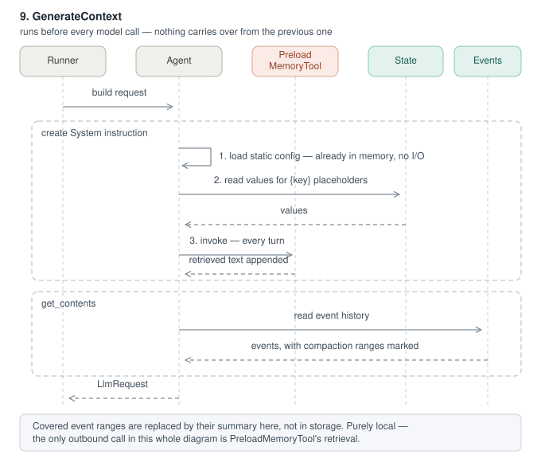

Pure read: no arrow writes to Events or State. Only one step leaves the process — Preload's retrieval.
Everything else reads values that are already in memory.

### 4.10 handle User turn

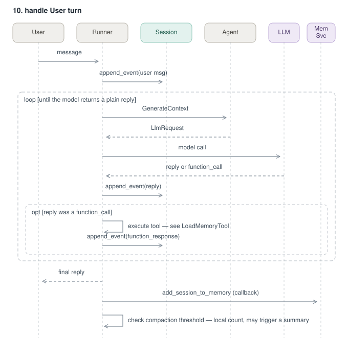

  

GenerateContext is inside the loop, so every tool call rebuilds the entire prompt from scratch and
sends it again. The user gets the reply before ingestion and the compaction check run — neither
blocks the response.

## 5. Summary

- `append_event()` is the single write path — it appends to the log and merges `state_delta` in one atomic step.
- State is a projection of the event log, never a source of truth. Direct writes to `session.state` are not persisted.
- Rules that must never be missed belong in `instruction=`, not in memory. Memory retrieval is probabilistic; instruction is guaranteed.
- Compaction replaces a window in the prompt only. Raw events stay in storage, which is why memory ingestion still reads the originals.
- Every tool round trip costs another full context rebuild and another model call.
